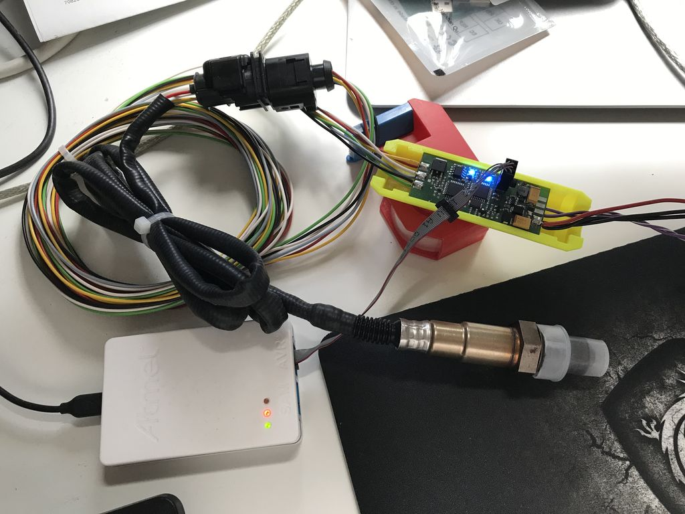
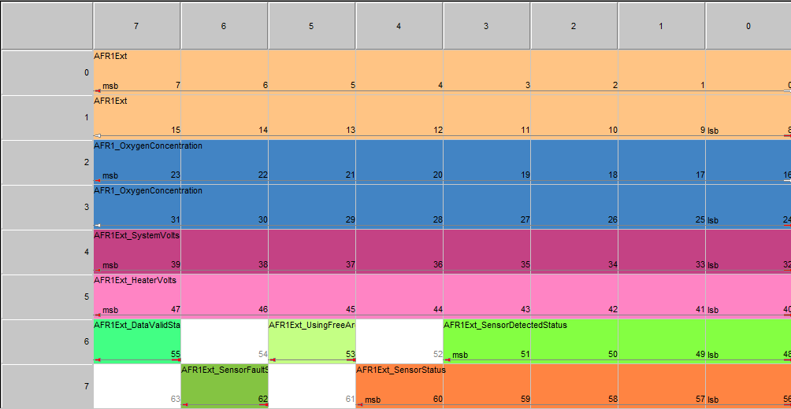
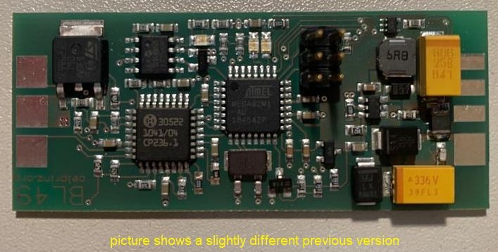
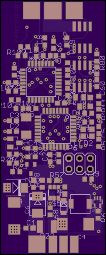
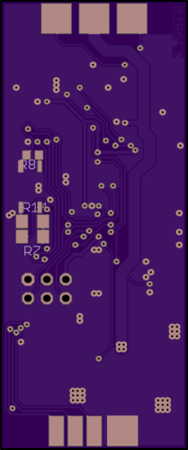
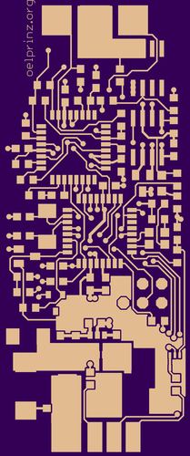
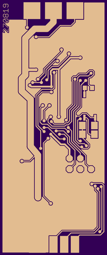

# BL49

Wideband Lambda Controller with Bosch CJ125 and LSU 4.9 with 0-5V output and CAN-Bus Interface

Feature list

- CAN output, compatible with AEM X-Series UEGO
- analog output for lambda 0.65 to 1.3 (0.25v to 4.8V)
- debug messages over CAN (pid, heater status, diag registers, ...)
- activatable via TTL input
- fast: 10ms refresh rate (reading the probe, calculation lambda and O2, sending CAN message and setting analog output)
- Bosch recommended heating strategy

19.09.2022 - Current status of firmware development

- analog output for lambda 0.65 to 1.3 (0.25v to 4.8V): done
- CAN output (AEM X-Series UEGO protocol): done
- debug messages over CAN: done
- Bosch recommended heating strategy: done
- PID controller for heating the probe: done

29.04.2020 - Version 0.0.1 - only hardware released / no software available at the moment  

Interactive BOM for easier hand-soldering you can download from the github (BL49/hardware/V0.0.1/bom)  
or access online here: <https://oelprinz.000webhostapp.com/BL49/V0.0.1/iBOM/ibom.html>  
Quick link to schematic: <https://github.com/oelprinz-org/BL49/blob/master/hardware/V0.0.1/schematics.pdf>  

## Bosch CJ125 (LQFP32 package) part numbers

|Bosch part number|
|:----------------|
|30615|
|40103|
|30522|

### Hardware

### AEM X-Series CAN layout

### Assembled Prototype

### Layout

