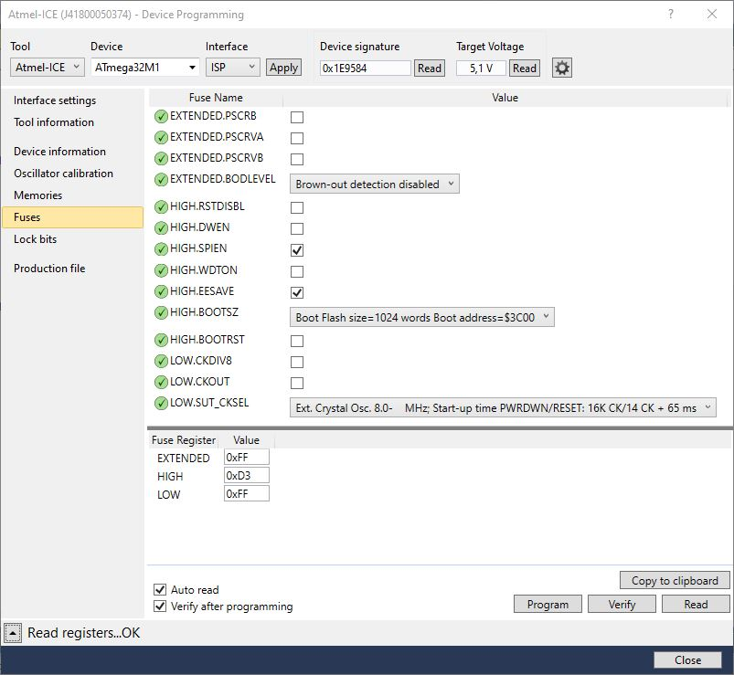

# BL49

Wideband Lambda Controller with Bosch CJ125 and LSU 4.9 with 0-5V output and CAN-Bus Interface

Feature list

- CAN output, compatible with AEM X-Series UEGO
- analog output for lambda 0.65 to 1.3 (0.25v to 4.8V)
- debug messages over CAN (pid, heater status, diag registers, ...)
- activatable via TTL input (INPUT 1)
- fast: 10ms refresh rate (reading the probe, calculation lambda and O2, sending CAN message and setting analog output)
- Bosch recommended heating strategy

## 04.01.2023 - Current status of firmware development

- analog output for lambda 0.65 to 1.3 (0.25v to 4.8V): done
- CAN output (AEM X-Series UEGO protocol): done
- debug messages over CAN: done
- Bosch recommended heating strategy: done
- PID controller for heating the probe: done
- activation per GPIO (pull **IN1** to GND): done
- <del>activation per CAN: open</del>

## 29.04.2020 - Version 0.0.1 - only hardware released / no software available at the moment  

Interactive BOM for easier hand-soldering you can download from the github (BL49/hardware/V0.0.1/bom)  
or access online here: <https://oelprinz.000webhostapp.com/BL49/V0.0.1/iBOM/ibom.html>  
Quick link to schematic: <https://github.com/oelprinz-org/BL49/blob/master/hardware/V0.0.1/schematics.pdf>  

## Bosch CJ125 (LQFP32 package) part numbers

|Bosch part number|
|:----------------|
|30615|
|40103|
|30522|

### Suitable Bosch lambda probes

Basically, the Bosch probes whose numbers start with **0 258 017** will fit, also Bosch **0 281 004**.  
Bosch numbers beginning with **0 258 007** are *LSU 4.2* probes and will not fit.

|Bosch number  |Length overall|Comment|
|--------------|--------------|-------|
|0 258 017 012 |1060mm||
|0 258 017 025 |1000mm|Bosch motorsport part, **tested during development**|
|0 281 004 028 |540mm|common probe for diesel engines, **Used during development**|
|0 258 017 029 |620mm|grey, used by BMW after 09/2006 (1178 7539124)|
|0 258 017 038 |340mm|grey, used by BMW (11787537984)|
|0 258 017 092 |950mm|black, used by BMW (1178 7540167)|
|0 258 017 126 |680mm|black, used by BMW after 09/2006 (1178 7561410)|
|0 281 004 150 |1215mm||
|0 281 004 184 |1000mm||
|...|||

### LSU4.9 probe pinout

|Pin#|Color|Description|Symbol|
|----|-----|--------|-----------|
|1|red|Pump current APE|IP|
|2|yellow|Virtual ground IPN|VM|
|3|white|Heater voltage H-|Uh-|
|4|grey|Heater voltaget H+|Uh+|
|5|green|Trim Resistor RT|IA|
|6|black|Nernst voltage UN|RE|

### Hardware

### MCU Fuses

### AEM X-Series CAN layout

### Assembled Prototype

### PCB Layout

